# HouseMate Finance — Geliştirme Planı

PRD v3.0 tam kapsam. Orchestrator fazları yönetir; subagent'lar paralel çalışır, sahiplik matrisine uyar.

## Faz özeti

```mermaid
gantt
    title HouseMate Geliştirme Fazları
    dateFormat X
    axisFormat %s

    section F0
    Schema + Contract     :f0, 0, 1

    section F1
    House module          :f1a, 1, 2
    Absence+Snapshot      :f1b, 1, 2
    Frontend shell        :f1c, 1, 2

    section F2
    Expense engine        :f2a, 2, 3
    Rotational            :f2b, 2, 3
    Frontend houses       :f2c, 2, 3

    section F3
    Dashboard+Activity    :f3a, 3, 4
    Jobs+Mail             :f3b, 3, 4
    Frontend expenses     :f3c, 3, 4

    section F4
    Frontend dashboard    :f4, 4, 5
    Integration           :f5, 5, 6
```

---

## Faz 0 — Contract & Schema (sıralı, tek agent)

**Agent:** `housemate-schema`  
**Çıktı:** Prisma modelleri, migration, `packages/shared` tipleri, `docs/api-contract.md`, `backend/src/domain/contracts/`

**Kabul kriterleri:**
- [ ] PRD Bölüm 4 tüm tablolar Prisma'da
- [ ] Enum'lar `@housemate/shared` ile uyumlu
- [ ] Contract interface'leri: `ISnapshotService`, `IHouseMembershipService`, `IExpenseSplitCalculator`
- [ ] Migration çalışır (`npm run prisma:mig`)

**Paralel:** Yok — tüm Faz 1+ bunu bekler.

---

## Faz 1 — Temel domain (3 agent paralel)

| Agent | Bağımlılık | Paralel |
|-------|------------|---------|
| `housemate-house` | F0 | ✅ |
| `housemate-absence-snapshot` | F0 | ✅ |
| `housemate-frontend-shell` | F0 (shared types) | ✅ |

### house
- POST/GET `/houses`, join, members, remove
- FR-1.1–1.3
- `MEMBER_JOIN` snapshot tetikleme (snapshot service çağrısı)

### absence-snapshot
- Absence CRUD, overlap kontrolü
- `BalanceSnapshot` + entries + `rotational_counts`
- Snapshot oluşturma algoritması (PRD 5.3–5.4)
- Cron job iskeleti (BullMQ worker kaydı — iş mantığı Faz 3'te genişler)

### frontend-shell
- Vite + React + Router
- Auth flow (mevcut `/auth` API)
- API client, protected routes, layout
- House context provider (boş state)

**Faz 1 gate:** House API + snapshot service callable + frontend login çalışır.

---

## Faz 2 — Harcama motoru (3 agent paralel)

| Agent | Bağımlılık | Paralel |
|-------|------------|---------|
| `housemate-expense` | F1 house | ✅ |
| `housemate-rotational` | F1 absence-snapshot | ✅ |
| `housemate-frontend-houses` | F1 shell | ✅ |

### expense
- INSTANT + REGULAR expense create/list/detail
- Split hesaplama (PRD 5.2), exclusions, respectsAbsence
- RegularExpenseTemplate CRUD
- ExpenseSplits yazımı (ROTATIONAL hariç)

### rotational
- RotationalExpenseType CRUD
- Sıra algoritması (PRD 5.1)
- ROTATIONAL expense — ExpenseSplits **yok**
- Sıra uyumsuzluğu uyarısı + override

### frontend-houses
- Ev oluştur/katıl, üye listesi, admin işlemleri
- Yokluk takvimi UI

**Faz 2 gate:** Üç harcama tipi API'den test edilebilir.

---

## Faz 3 — Özet, işler, UI (3 agent paralel)

| Agent | Bağımlılık | Paralel |
|-------|------------|---------|
| `housemate-dashboard` | F2 expense | ✅ |
| `housemate-jobs-mail` | F2 expense, F1 snapshot | ✅ |
| `housemate-frontend-expenses` | F2 APIs | ✅ |

### dashboard
- GET dashboard, member debt detail, activity feed
- Snapshot-tabanlı bakiye (PRD 5.3)
- ROTATIONAL borç hesabına dahil değil

### jobs-mail
- Düzenli gider hatırlatma cron
- Yokluk start/end gece yarısı cron (FR-2.5, FR-2.6)
- Anlık gider bildirimi kuyruğu
- Aylık özet cron (FR-9.3)
- Sıra değişimi bildirimi (FR-9.4)
- SES şablonları `housemate-*.hbs`

### frontend-expenses
- Anlık/düzenli/sıralı gider formları
- Şablon yönetimi (admin)
- Sıra göstergesi

**Faz 3 gate:** Dashboard doğru bakiye; mailler kuyruğa düşer.

---

## Faz 4 — Dashboard UI + entegrasyon

| Agent | Paralel |
|-------|---------|
| `housemate-frontend-dashboard` | Tek başına (F3 bitti) |
| **orchestrator** | `server.ts` route merge, E2E smoke |

**Kabul:** PRD tüm FR maddeleri checklist'ten geçer (`docs/PRD_CHECKLIST.md`).

---

## Paralellik matrisi

|  | F0 | F1 house | F1 snap | F1 fe-shell | F2 exp | F2 rot | F2 fe-h | F3 dash | F3 jobs | F3 fe-e | F4 fe-d |
|--|:--:|:--:|:--:|:--:|:--:|:--:|:--:|:--:|:--:|:--:|:--:|
| F0 | — | | | | | | | | | | |
| F1 house | ✓ | — | ✅ | ✅ | | | | | | | |
| F1 snap | ✓ | ✅ | — | ✅ | | | | | | | |
| F1 shell | ✓ | ✅ | ✅ | — | | | | | | | |
| F2 exp | | ✓ | | | — | ✅ | ✅ | | | | |
| F2 rot | | | ✓ | | ✅ | — | ✅ | | | | |
| F2 fe-h | | ✓ | | ✓ | ✅ | ✅ | — | | | | |
| F3 dash | | | | | ✓ | | | — | ✅ | ✅ | |
| F3 jobs | | | ✓ | | ✓ | | | ✅ | — | ✅ | |
| F3 fe-e | | | | ✓ | ✓ | ✓ | | ✅ | ✅ | — | |
| F4 fe-d | | | | ✓ | ✓ | ✓ | ✓ | ✓ | ✓ | ✓ | — |

---

## Orchestrator iş akışı

1. Faz gate kontrolü
2. Paralel agent'ları `Task` tool ile başlat (skill + prompt şablonu)
3. `docs/agents/PROMPTS.md` şablonunu doldur
4. Çakışma: OWNERSHIP ihlali → geri gönder
5. `server.ts` merge tek orchestrator'da
6. Faz sonu: smoke test checklist
7. **Commit + push** (her adım sonrası — aşağıya bak)

Detay promptlar: [docs/agents/PROMPTS.md](./agents/PROMPTS.md)

---

## Git: commit ve push (zorunlu)

| Olay | Commit örneği | Push |
|------|---------------|------|
| Subagent görevi tamam | `feat(house): add house and member APIs` | Hemen |
| Paralel grup bitti + merge | `chore(phase-1): integrate house routes` | Hemen |
| Faz gate geçti | `chore(phase-1): complete phase gate` | Hemen |
| Altyapı / docs / rules | `chore: ...` | Hemen |

- Commit ve push **yalnızca orchestrator** tarafından yapılır.
- Kural: `.cursor/rules/housemate-git-workflow.mdc`
- Force push ve hook atlama yasak.
